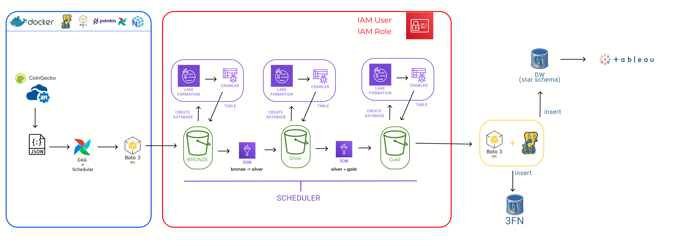
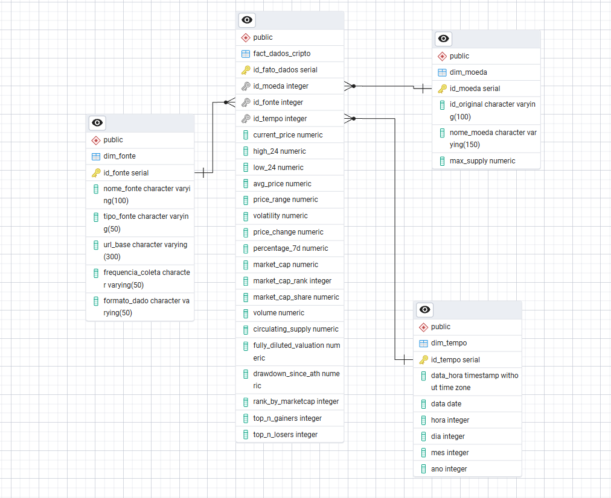
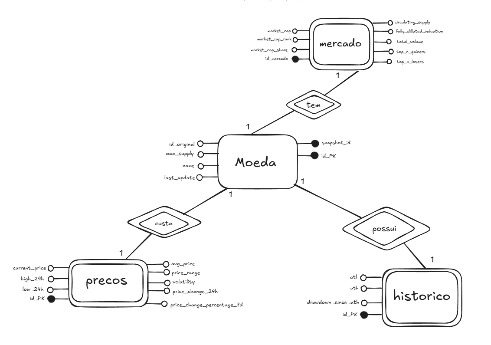
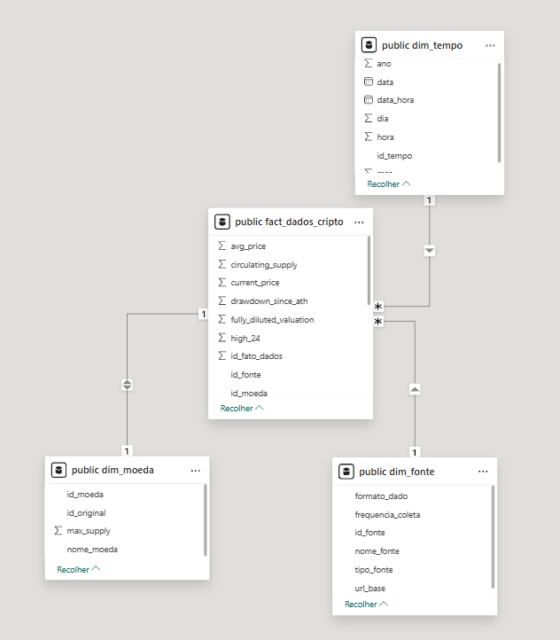
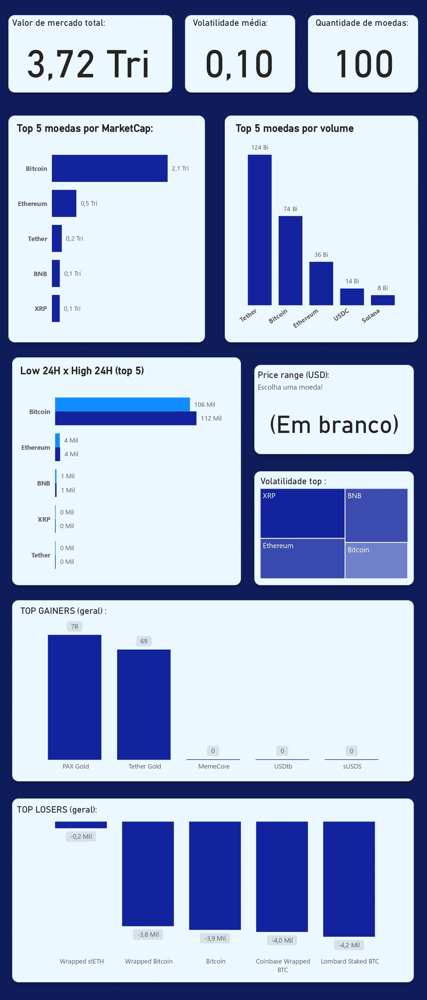
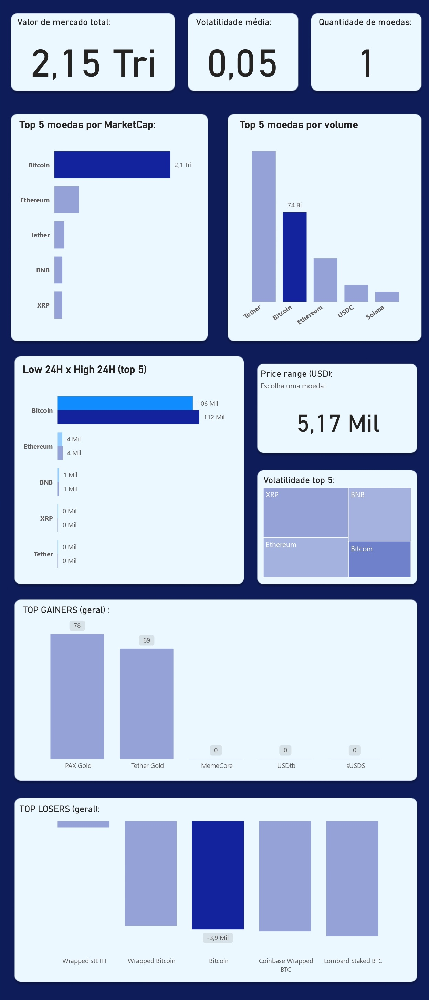

# Data Lakehouse Completo: CoinGecko ETL (Airflow, AWS Glue, PostgreSQL DW / OLTP)

Este projeto implementa uma pipeline completa de engenharia de dados que realiza toda a ETL de informações de criptomoedas.  
Primeiramente acontece a coleta de dados da API pública da CoinGecko, processa e transforma as informações em diferentes camadas de armazenamento do Bucket S3(bronze, silver, gold), e por fim, armazena duas versões dos dados no PostgreSQL:


| Tipo de Banco              | Modelo       | Objetivo   |
|:--------------------|:-------------:|--------------:|
|  **OLTP**    | Normalizado (3FN) | Garantir ACID |
|  **DW** | Modelo Estrela | Facilitar consultas analíticas e relatórios (Tableau) |

## DIAGRAMA TEXTO - Fluxo
API (CoinGecko) -> Airflow (execução semanal) -> AWS S3 (Camada Bronze) ->  AWS Glue / PySpark (Limpeza e Transformações) -> AWS S3 (Camada Silver) -> 
Transformações (Camada Gold) -> PostgreSQL (OLTP + DW Estrela) -> Tableau (Dashboards)

## 📈IMAGEM DIAGRAMA GERAL (Ainda preciso fazer)


# ▶️ EXECUÇÃO DO PROJETO

## 1️⃣ Criando Usuário IAM
- Criar usuário IAM .
- Habilitar Programmatic access (Access Key ID + Secret Access Key).
- Conceder permissões para testes (AmazonS3FullAccess + AWSGlueConsoleFullAccess + AWSLakeFormationDataAdmin) .
- Salvar as keys em local seguro.

## 2️⃣ Criar Bucket S3
- Criar bucket.
- Criar estrutura de pastas.
```
bronze/
silver/
gold/
```

## 3️⃣ Configurar Dockerfile
```
FROM apache/airflow:3.1.1

ENV PYTHONDONTWRITEBYTECODE=1
ENV PYTHONUNBUFFERED=1

RUN pip install --no-cache-dir \
    boto3 \
    pandas \
    numpy \
    psycopg2-binary
```

## 4️⃣ Configurar Docker Compose
- Execute os comandos:
```
#1 - docker-compose build

#2 - docker-compose run --rm airflow-init

#3 - docker-compose up -d

docker-compose down (Quando terminar)

```
## 5️⃣ Configurar .env
```
# docker airflow
AIRFLOW_IMAGE_NAME=apache/airflow:3.0.0
AIRFLOW_UID=50000

#chave api 
COINGECKO_API_KEY= SUACHAVEAPI

#url api
API_URL=https://api.coingecko.com/metricasqueforusar

#configs aws 
BUCKET_NAME=NOMEDOSEUBUCKET
S3_PATH=bronze/SUAPASTA
LOCAL_PATH=/tmp/coins_markets.json
PROFILE_NAME=NOMEDOSEUPROFILE

S3_KEY=CAMINHOENOMEDOSEUARQUIVOGOLD

# aws variaveis : 

AWS_ACCESS_KEY_ID=sua_access_keyid
AWS_SECRET_ACCESS_KEY=sua_secret_access_key
AWS_DEFAULT_REGION=regiao

# variaveis 
DB_HOST=host.docker.internal
DB_NAME_DW=nome_do_seu_DW
DB_NAME_FN=nome_do_seu_3fn
DB_USER=userdopostgre
DB_PASS=senhadopostgre
DB_PORT=portdopostgre


```
## 6️⃣ Criar DAG no Airflow
- Executar semanalmente (toda segunda-feira).
- Extrair dados da API e salvar localmente em JSON.
- Fazer upload para S3 (camada bronze - dados raw).

## 7️⃣ Criar Glue Job para Camada Silver

## 7.1 Criar Role para Governança no Lake Formation
### 1. No IAM, criar nova role:
- Caso de uso: Lake Formation.
- Permissões: (AWSLakeFormationDataAdmin + AWSGlueConsoleFullAccess + AmazonS3FullAccess)
- Salvar role (ex.: GlueLakeFormationAdminRole).

## 7.2 Configurar Lake Formation
### 1. Ir em Administrative roles and tasks → Add admin
- Adicionar a role criada e o usuário IAM.

### 2. Em Data locations, adicionar o bucket S3 inteiro:
- Escolha seu path: s3://nome_do_seu_bucket
- Selecionar a IAM role criada.  
- Clicar em Grant e conceder permissões para o usuario IAM.

## 7.3 Criar Database no Lake Formation

- Database Bronze: Clique em databases -> create database .
- Location seus arquivos raw (layer bronze) .

## 7.4 Criar role Glue
- Ir no IAM -> Criar role
- Aws Service / Use case : Glue .

### Permissões
 - (AmazonS3FullAccess + AWSGlueServiceRole )


## 7.5 Criar Crawler Bronze

- Glue -> Crawler -> create crawler.
- Coloque o path de onde está o json extraido (arquivo raw). 
- Coloque sua role Glue criada anteriormente .
- Colocar o database que criamos.
- Configurar o Scheduler para toda segunda as 09:00 (mas é UTC).
```
cron(0 12 ? * 2 *) 
```
- Rodei manualmente o Crawler a primeira vez.

## 7.6 Criar Glue Job para Camada Silver (Script)
### Transformações que queremos :

- Remover colunas desnecessárias
- Tratar campos nulos
- Padronizar datas (last_updated) para timestamp
- Explodir JSON aninhado (array)
- Remover duplicados
- Salvar em Parquet na camada Silver


## Configurações necessárias (Do Script) :

### 1. Colocar a Role Glue criada no script. 

### 2. Parâmetros do job:
```
--S3_INPUT_PATH s3://seu-bucket/bronze/coins_markets/
--S3_OUTPUT_PATH s3://seu-bucket/silver/coins_markets/
```
### 3. Scheduler: toda segunda-feira às 10:00: 
```
cron(0 13 ? * 2 *)
```
## 7.7 Exemplo de transformação : 

### Antes: 
```
 {
        "id": "bitcoin",
        "symbol": "btc",
        "name": "Bitcoin",
        "image": "https://coin-images.coingecko.com/coins/images/1/large/bitcoin.png?1696501400",
        "current_price": 106574,
        "market_cap": 2127884242358,
        "market_cap_rank": 1,
        "fully_diluted_valuation": 2127884242358,
        "total_volume": 71983632523,
        "high_24h": 111758,
        "low_24h": 106522,
        "price_change_24h": -4046.871374368362,
        "price_change_percentage_24h": -3.65834,
        "market_cap_change_24h": -81060466237.28638,
        "market_cap_change_percentage_24h": -3.66965,
        "circulating_supply": 19942003.0,
        "total_supply": 19942003.0,
        "max_supply": 21000000.0,
        "ath": 126080,
        "ath_change_percentage": -15.57379,
        "ath_date": "2025-10-06T18:57:42.558Z",
        "atl": 67.81,
        "atl_change_percentage": 156876.91391,
        "atl_date": "2013-07-06T00:00:00.000Z",
        "roi": null,
        "last_updated": "2025-10-30T20:02:16.030Z",
        "price_change_percentage_1h_in_currency": -0.39510474430048337,
        "price_change_percentage_24h_in_currency": -3.6583375813917964,
        "price_change_percentage_7d_in_currency": -3.3426460949101213
    }

```

### Depois: 
#### Arquivo convertido de parquet pra json para fins de exemplo!
```
{
    "id":"aave",
    "symbol":"aave",
    "name":"Aave",
    "last_updated":"2025-10-30 21:45:27.899000000",
    "current_price":211.24,
    "high_24h":234.53,
    "low_24h":208.22,
    "market_cap":3223271500,
    "market_cap_rank":47,
    "fully_diluted_valuation":3379629509,
    "volume":314855460,
    "price_change_24h":-23.291466577591734,
    "percentage_7d":-5.670162832082476,
    "ath":661.69,"atl":26.02,
    "circulating_supply":15259762.604990805,
    "max_supply":16000000
    }
```

## 7.8 Crawler e Database para Camada Silver:

### Antes de tudo crie um database no lake formation.

### Vamos criar o crawler e configurar pra rodar toda segunda após o script :

- Escolha a pasta onde estão seus dados silver .
- Coloque a role glue criada anteriormente . 
- Coloque o database silver que criamos . 
- Coloque no scheduler cron(15 13 ? * 2 *)
- Agora o crawler vai sempre rodar depois do script. 

## 8️⃣ Criar Camada Gold

### 8.1 Definindo métricas da camada gold. 
#### PREÇOS:
| Métrica             | Como Calcular      | Objetivo   |
|:--------------------|:-------------:|--------------:|
|  **current_price**    | Já existe no Silver | Preço atual da moeda no snapshot|
|  **high_24h** | Já existe no Silver | Maior preço nas últimas 24h |
|  **low_24h** | Já existe no Silver | Menor preço nas últimas 24h |
|  **avg_price** | (high_24h + low_24h)/2 | Média diária de negociação — mais representativa que apenas o preço atua |
|  **price_range** | high_24h - low_24h| Amplitude do preço — indica volatilidade do dia |
|  **volatility** | price_range / avg_price | Percentual de oscilação diária, indicador de risco |
|  **price_change_24h** | Já existe no Silver | Variação do preço nas últimas 24h |
|  **percentage_7d** | Já existe no Silver | Variação percentual nos últimos 7 dias — tendência semanal |

#### Capitalização e Volume:
| Métrica             | Como Calcular      | Objetivo   |
|:--------------------|:-------------:|--------------:|
|  **market_cap**    | Já existe no Silver | Valor total da moeda no mercado|
|  **market_cap_rank** | Já existe no Silver | Ranking por valor de mercado|
|  **market_cap_share** | market_cap / SUM(market_cap) (por snapshot) | Percentual de participação da moeda no mercado total |
|  **volume** | Já existe no Silver| Volume de negociação, indicador de liquidez |

#### Força Histórica:
| Métrica             | Como Calcular      | Objetivo   |
|:--------------------|:-------------:|--------------:|
|  **ath**    | Já existe no Silver | Preço máximo histórico da moeda|
|  **atl** | Já existe no Silver | Preço mínimo histórico|
|  **drawdown_since_ath** | (ath - current_price)/ath | Queda percentual em relação ao topo histórico — risco da moeda |
|  **volume** | Já existe no Silver| Volume de negociação, indicador de liquidez |

#### Oferta e Diluição:
| Métrica             | Como Calcular      | Objetivo   |
|:--------------------|:-------------:|--------------:|
|  **circulating_supply**    | Já existe no Silver | Quantidade de moedas em circulação|
|  **max_supply** | Já existe no Silver | Limite máximo de emissão de moedas|
|  **fully_diluted_valuation** | Já existe no Silver | Capitalização máxima potencial |
|  **supply_utilization** | circulating_supply / max_supply| Percentual da oferta emitida, indicador de escassez |

#### Ranking e Métricas Agregadas: 
| Métrica             | Como Calcular      | Objetivo   |
|:--------------------|:-------------:|--------------:|
|  **rank_by_marketcap**    | dense_rank() sobre market_cap | Ranking automático de valor de mercado|
|   **top_n_gainers** | baseado em price_change_24h | Destaque das moedas que mais valorizaram |
|  **top_n_losers** | baseado em price_change_24h | Destaque das moedas que mais perderam valor |

#### Metadados_Controle: 
| Métrica             | Como Calcular      | Objetivo   |
|:--------------------|:-------------:|--------------:|
|  **last_updated**    | já existe | Referência temporal do snapshot|
|  **snapshot_id** | concat de id + last_updated | ID único para rastreabilidade e garantia de idempotência|

### 8.2 Fazendo o Glue Job (Silver -> Gold): 

- Configurando as variaveis de path :  
```
--S3_INPUT_PATH (onde estao seus dados silver).
--S3_OUTPUT_PATH(pra onde vão seus dados gold)
```

- Coloque a role glue que criamos anteriormente .

- Agora cole o script que esta na pasta scripts do projeto  : 

- Configure o scheduler é so fazer cron(30 13 ? * 2 *).


### 8.3 Agora vamos criar o database da camada gold .

### 8.4 Agora vamos rodar o crawler da camada gold tambem .
- Configure o Scheduler para : cron(45 13 ? * 2 *).

### 8.5 versão final dos dados na layer gold : 
```
{
    "id":"lombard-staked-btc",
    "name":"Lombard Staked BTC",
    "current_price":107429,
    "high_24h":111727,
    "low_24h":106587,
    "avg_price":109157,
    "price_range":5140,
    "volatility":0.0470881391023938,
    "price_change_24h":-4159.485680905098,
    "percentage_7d":-2.10035461481091,
    "market_cap":1303673055,
    "market_cap_rank":95,
    "market_cap_share":0.00035046558802565616,
    "ath":125812,
    "atl":52119,
    "drawdown_since_ath":0.1461148380122723,
    "circulating_supply":12132.55546961,
    "max_supply":null,
    "fully_diluted_valuation":1303673055,
    "supply_utilization":null,
    "rank_by_marketcap":95,
    "top_n_gainers":0,
    "top_n_losers":1,
    "volume":8004376,
    "last_updated":"2025-10-30 21:45:33.287000000",
    "snapshot_id":"lombard-staked-btc20251030214533"
}
```

## 9️⃣ Modelar Bancos de Dados

### 9.1 Schema DW (modelo estrela).

### - Primeiramente a modelagem. 



### - Cole no pgadmin4 sl o script 'script_create_DW_star_schema' na pasta model. 
```
-- sempre começar com as dimensões : 


CREATE TABLE dim_moeda (
    id_moeda SERIAL PRIMARY KEY,
    id_original VARCHAR(100) NOT NULL,
    nome_moeda VARCHAR(150),
    max_supply NUMERIC
);


CREATE TABLE dim_tempo (
    id_tempo SERIAL PRIMARY KEY,       
    data_hora TIMESTAMP NOT NULL,
    data DATE,
    hora INT,
    dia INT,
    mes INT,
    ano INT
);

CREATE TABLE dim_fonte (
    id_fonte SERIAL PRIMARY KEY,
    nome_fonte VARCHAR(100),
    tipo_fonte VARCHAR(50),
    url_base VARCHAR(300),
    frequencia_coleta VARCHAR(50),
    formato_dado VARCHAR(50)
);


CREATE TABLE fact_dados_cripto (
    id_fato_dados SERIAL PRIMARY KEY,
    id_moeda INT NOT NULL REFERENCES dim_moeda(id_moeda),
    id_fonte INT NOT NULL REFERENCES dim_fonte(id_fonte),
    id_tempo INT NOT NULL REFERENCES dim_tempo(id_tempo),
    id_snapshot INT NOT NULL REFERENCES dim_snapshot(id_snapshot),
    current_price NUMERIC,
    high_24 NUMERIC,
    low_24 NUMERIC,
    avg_price NUMERIC,
    price_range NUMERIC,
    volatility NUMERIC,
    price_change NUMERIC,
    percentage_7d NUMERIC,
    market_cap NUMERIC,
    market_cap_rank INT,
    market_cap_share NUMERIC,
    volume NUMERIC,
    circulating_supply NUMERIC,
    fully_diluted_valuation NUMERIC,
    drawdown_since_ath NUMERIC,
    rank_by_marketcap INT,
	top_n_gainers INT CHECK (top_n_gainers IN (0,1)),
	top_n_losers INT CHECK (top_n_losers IN (0,1))
);


```
### 9.2 Schema OLTP (normalizado).

### Modelo Conceitual: 


### Modelo Lógico : 
```
moeda(*id_moeda*, *snapshot_id*, id_original, nome, max_supply, last_update)

precos(*id_preco*, **id_moeda**, **snapshot_id**, current_price, high_24h, low_24h, avg_price, price_range, volatility, price_change_24h, price_change_percentage_7d)
(**id_moeda**, **snapshot_id**) referencia moeda(id_moeda, snapshot_id)

mercado(*id_mercado*, **id_moeda**, **snapshot_id**, market_cap_share, market_cap_rank, market_cap, circulating_supply, fully_diluted_valuation, total_volume, top_n_gainers, top_n_losers)
(**id_moeda**, **snapshot_id**) referencia moeda(id_moeda, snapshot_id)

historico(*id_historico*, **id_moeda**, **snapshot_id**, atl, ath, drawdown_since_ath)
(**id_moeda**, **snapshot_id**) referencia moeda(id_moeda, snapshot_id)

```

### Modelo Físico: (Rode o Script 'script_create_DW_3fn' da pasta models )
```
CREATE TABLE moeda (
    id_moeda INT NOT NULL,
    snapshot_id VARCHAR(100) NOT NULL,
    id_original VARCHAR(100) NOT NULL,
    max_supply NUMERIC,
    nome VARCHAR(150),
    last_update TIMESTAMP,
    CONSTRAINT pk_moeda PRIMARY KEY (id_moeda, snapshot_id)
);


CREATE TABLE precos (
    id_preco SERIAL PRIMARY KEY,
    id_moeda INT NOT NULL,
    snapshot_id VARCHAR(100) NOT NULL,
    current_price NUMERIC,
    high_24h NUMERIC,
    low_24h NUMERIC,
    avg_price NUMERIC,
    price_range NUMERIC,
    volatility NUMERIC,
    price_change_24h NUMERIC,
    price_change_percentage_7d NUMERIC,
    CONSTRAINT fk_precos_moeda 
        FOREIGN KEY (id_moeda, snapshot_id)
        REFERENCES moeda(id_moeda, snapshot_id)
        ON DELETE CASCADE
);


CREATE TABLE mercado (
    id_mercado SERIAL PRIMARY KEY,
    id_moeda INT NOT NULL,
    snapshot_id VARCHAR(100) NOT NULL,
    market_cap_share NUMERIC,
    market_cap_rank INT,
    market_cap NUMERIC,
    circulating_supply NUMERIC,
    fully_diluted_valuation NUMERIC,
    total_volume NUMERIC,
    top_n_gainers INT CHECK (top_n_gainers IN (0,1)),
    top_n_losers INT CHECK (top_n_losers IN (0,1)),
    CONSTRAINT fk_mercado_moeda 
        FOREIGN KEY (id_moeda, snapshot_id)
        REFERENCES moeda(id_moeda, snapshot_id)
        ON DELETE CASCADE
);


CREATE TABLE historico (
    id_historico SERIAL PRIMARY KEY,
    id_moeda INT NOT NULL,
    snapshot_id VARCHAR(100) NOT NULL,
    atl NUMERIC,
    ath NUMERIC,
    drawdown_since_ath NUMERIC,
    CONSTRAINT fk_historico_moeda 
        FOREIGN KEY (id_moeda, snapshot_id)
        REFERENCES moeda(id_moeda, snapshot_id)
        ON DELETE CASCADE
);
``` 


## 1️⃣0️⃣ Ingestão nos Bancos

### 10.1 caso necessário configure no docker-compose a sua pasta scripts 
- algo assim ( ${AIRFLOW_PROJ_DIR:-.}/scripts:/opt/airflow/scripts)

### 10.2 Rode o Script (load_gold_to_dw.py) para popular seu DW:

```
docker exec -it (nome do seu worker) bash
python /opt/airflow/scripts/load_gold_to_dw.py
```

### 10.3 Rode o Script (load_gold_to_3fn.py) para popular seu DW:

```
docker exec -it (nome do seu worker) bash
python /opt/airflow/scripts/load_gold_to_3fn.py
```

## 1️⃣1️⃣ Tableau
### 11.1 Conectar ao PostgreSQL no Tableau. 
- Pode ser necessário instalar o Driver de conexão do PostgreSQL  

### 11.2 No projeto entre na pasta (views_DW_tableau), depois rode o script (views_DW_tableau) :

- Desse modo vamos criar novas views , que serão usadas na modelagem.

### 11.3 Usando o tableau : 
- Abra o arquivo twbx (tableau_complet_with_data.twbx).
- Trabalhe seus dashboards que quiser! 

### 11.4 EXEMPLO DE DASHBOARD: 


- Link tableau : 
[Veja o dashboard no Tableau](https://public.tableau.com/app/profile/pedro.paulo.moreira.damasceno/viz/tableau_complet_with_data/Dashboard-Metricsofthecoins?publish=yes)

## 12 - Power BI

### 12.1 Faça integração do Power BI com o Postgres.
### 12.2 Drop na Coluna max_supply necessário.

### 12.3 Ver se as relações estão corretas : 


### 12.4 Agora vamos criar algumas medidas úteis com DAX: 
```
MarketCap_Total = SUM(fact_dados_cripto[market_cap])

Volatilidade_Média = AVERAGE(fact_dados_cripto[volatility])

Faixa_Precos = SUM(fact_dados_cripto[high_24]) - SUM(fact_dados_cripto[low_24])

```

### 12.5 - Exemplo (Sem escolher moeda): 



### 12.6 - Exemplo (Escolhendo moeda): 


### 12.7 - O arquivo completo se encontra em Power BI files